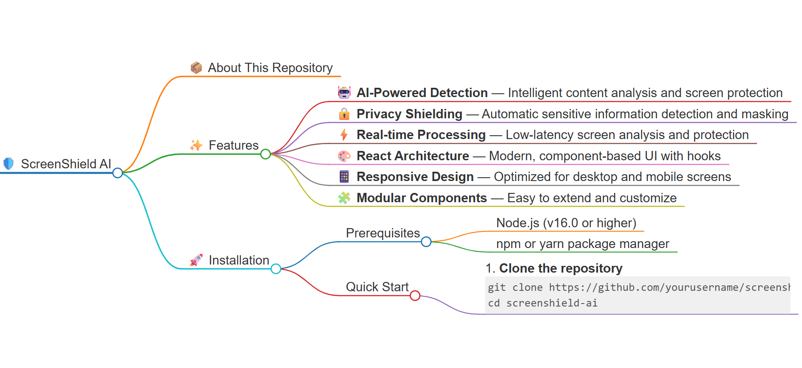

# 🛡️ ScreenShield AI

<p align="center">
  
</p>

## 📦 About This Repository

This repository contains the **ScreenShield AI** application — a React-based solution designed to provide intelligent screen protection, privacy filtering, and content shielding capabilities using advanced AI algorithms.

&gt; ⚠️ **Note**: The application source code is packaged in the `screenshield-ai.zip` file. See [Installation](#-installation) for setup instructions.

---

## ✨ Features

- 🤖 **AI-Powered Detection** — Intelligent content analysis and screen protection
- 🔒 **Privacy Shielding** — Automatic sensitive information detection and masking
- ⚡ **Real-time Processing** — Low-latency screen analysis and protection
- 🎨 **React Architecture** — Modern, component-based UI with hooks
- 📱 **Responsive Design** — Optimized for desktop and mobile screens
- 🧩 **Modular Components** — Easy to extend and customize

---

## 🚀 Installation

### Prerequisites
- Node.js (v16.0 or higher)
- npm or yarn package manager

### Quick Start

1. **Clone the repository**
   ```bash
   git clone https://github.com/yourusername/screenshield-ai.git
   cd screenshield-ai
2. **Extract the application**
   ```bash
   unzip screenshield-ai.zip -d app/
   cd app
3. **Install dependencies**
   ```bash
   npm install
   # or
   yarn install
4. **Start the development server**
   ```bash
   npm start
   # or
   yarn start

   The app will run on http://localhost:3000
 .. **🏗️ Project Structure**
  ```bash
    screenshield-ai/
 ├── public/                 # Static assets
 ├── src/
 │   ├── components/         # React components
 │   │   ├── Shield/         # Core protection components
 │   │   ├── Detector/       # AI detection modules
 │   │   └── UI/             # Interface elements
 │   ├── hooks/              # Custom React hooks
 │   ├── utils/              # Helper functions
 │   ├── services/           # AI service integrations
 │   ├── styles/             # CSS/SCSS files
 │   └── App.js              # Main application
 ├── package.json
  └── README.md

🔧 Configuration
Create a .env file in the root directory:
# AI Service API Keys
REACT_APP_AI_API_KEY=your_api_key_here
REACT_APP_AI_ENDPOINT=https://api.screenshield.ai/v1

# App Settings
REACT_APP_ENABLE_REALTIME=true
REACT_APP_PRIVACY_LEVEL=high
                                                 Built with ❤️ using React & AI
-----------------------------------------------------------------------------------------------------------------------------------------------------------------
🤝 Contributing
We welcome contributions! Please follow these steps:
Fork the repository
Create a feature branch (git checkout -b feature/amazing-feature)
Commit your changes (git commit -m 'Add amazing feature')
Push to the branch (git push origin feature/amazing-feature)
Open a Pull Request
📝 License
This project is licensed under the MIT License - see the LICENSE file for details.
🆘 Support
📧 Email: zainalvi552@gmail.com 
🐛 Issues: GitHub Issues
📖 Documentation: Wiki
